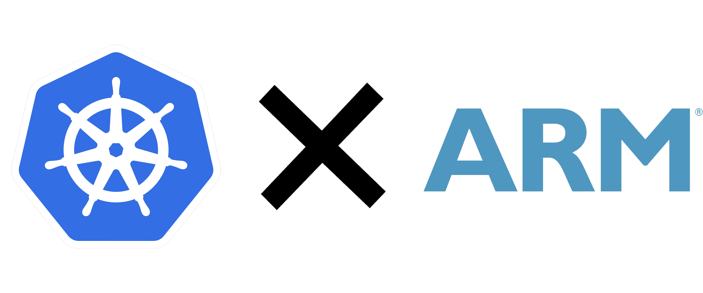

<p align="center">
  
</p>

<p align="left">
  
  
</p>

---

# Kubectl

Your [k8s](https://kubernetes.io) cluster swiss army knife, running in a container.

## Why should you use this?

Because this kubectl image is :

- lightweight
- secure
- multi-arch

New stable versions will be built and pushed automatically by *GitHub action* [workflow](https://github.com/clastix/kubectl/blob/master/.github/workflows/docker-ci.yml).

### Supported tags

| kubectl | amd64 | arm64 | armv7 |
| :---: | :---: | :---: | :---: |
|v1.22.2| :heavy_check_mark: | :heavy_check_mark: | :heavy_check_mark: |
|v1.21.1| :heavy_check_mark: | :heavy_check_mark: | :heavy_check_mark: |
|v1.20.7| :heavy_check_mark: | :heavy_check_mark: | :heavy_check_mark: |
|v1.19.4| :heavy_check_mark: | :heavy_check_mark: | :heavy_check_mark: |
|v1.18.8| :heavy_check_mark: | :heavy_check_mark: | :heavy_check_mark: |
|v1.17.11| :heavy_check_mark: | :heavy_check_mark: | :heavy_check_mark: |
|v1.16.15| :heavy_check_mark: | :heavy_check_mark: | :heavy_check_mark: |

Keep watching our [quay.io](https://quay.io/repository/clastix/kubectl) repository for the latest updates!

---

## Quickstart

### Prerequisites

Make sure you have a containerization software (e.g. _[Docker](https://www.docker.com/)_ ) installed on your device :

```
$ docker version

Client: Docker Engine - Community
 Cloud integration: 1.0.14
 Version:           20.10.6
 API version:       1.41
 Go version:        go1.13.15
 Git commit:        370c289
 Built:             Fri Apr  9 22:46:45 2021
 OS/Arch:           linux/amd64
 Context:           default
 Experimental:      true
[...]
```

### Take our image

Just pull the desired version from [quay.io](https://quay.io/repository/clastix/kubectl) :

```
$ docker pull quay.io/clastix/kubectl:v1.20.7

v1.20.7: Pulling from clastix/kubectl
540db60ca938: Already exists 
9f38dcb1a41d: Already exists 
71cd9ea851af: Already exists 
Digest: sha256:513848b048dcb2194f1896f56c7a8f6e4a2db8c33b52958a73a09012a1b1a12c
Status: Downloaded newer image for quay.io/clastix/kubectl:v1.20.7
quay.io/clastix/kubectl:v1.20.7
```

OR

### Build your image

running :

```bash
$ docker build . -t foo.io/bar/kubectl:<desired_version> --build-arg KUBECTL_VERSION=<desired_version> --build-arg TARGETARCH=<target_architecture>
```

or using **make** utility :
```
$ make docker-build
```
**N.B.** if you like, you can choose desired kubectl version and target architecture as follow :

```
$ export KUBECTL_VERSION=<desired_version>
$ export TARGETARCH=<target_architecture>
```
otherwise, Makefile will automatically retrieve its default values.

### Launch a container

```bash
$ docker run --name kubectl quay.io/clastix/kubectl:v1.22.2 version

Client Version: version.Info{Major:"1", Minor:"22", GitVersion:"v1.22.2", GitCommit:"8b5a19147530eaac9476b0ab82980b4088bbc1b2", GitTreeState:"clean", BuildDate:"2021-09-15T21:38:50Z", GoVersion:"go1.16.8", Compiler:"gc", Platform:"linux/amd64"}
```

you can also use your own _kubeconfig_

```
$ docker run --name kubectl -v ~/.kube/config:/home/nonroot/.kube/config quay.io/clastix/kubectl:v1.20.7 kubectl get nodes

NAME       STATUS   ROLES                  AGE   VERSION
master01   Ready    control-plane,master   21d   v1.20.7
master02   Ready    control-plane,master   21d   v1.20.7
master03   Ready    control-plane,master   21d   v1.20.7
worker01   Ready    worker                 21d   v1.20.7
worker02   Ready    worker                 21d   v1.20.7
[...]
```

### Removal
To clean up, just :

1. Remove your kubectl container :

    ```
    $ docker rm kubectl
    ```

3. Remove your kubectl image :

    ```
    $ docker rmi -f quay.io/clastix/kubectl:v1.20.7
    ```

## FAQ
- Q. Does it work on my architecture?

  A. We successfully tested it on amd and arm architectures; have a look at "[Supported tags'](https://github.com/clastix/kubectl#supported-tags)" section for more information.

- Q. Can I contribute?

  A. Absolutely!

## License

Licensed under the Apache License, Version 2.0 (the "License"); you may not use this file except in compliance with the License. You may obtain a copy of the License at :

http://www.apache.org/licenses/LICENSE-2.0

Unless required by applicable law or agreed to in writing, software distributed under the License is distributed on an "AS IS" BASIS, WITHOUT WARRANTIES OR CONDITIONS OF ANY KIND, either express or implied. See the License for the specific language governing permissions and limitations under the License.
